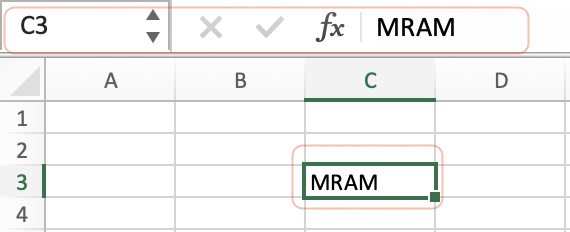
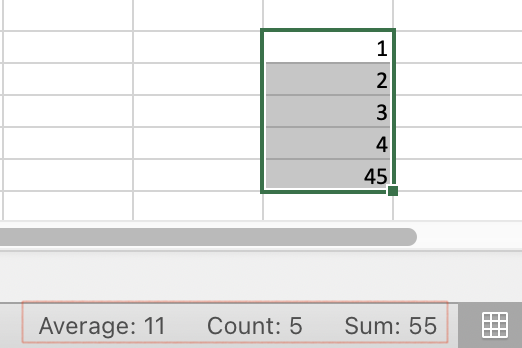

# Excel-Shortcuts
##### *in mac*

* command + right arrow : go to last colom 
* command + left arrow : back to first colom colom 
* there more than million rows in one sheet 
* each cell had a unique address
* add new sheet

* go to cell

* fast find avg by highlight cells you want to calculate
 

